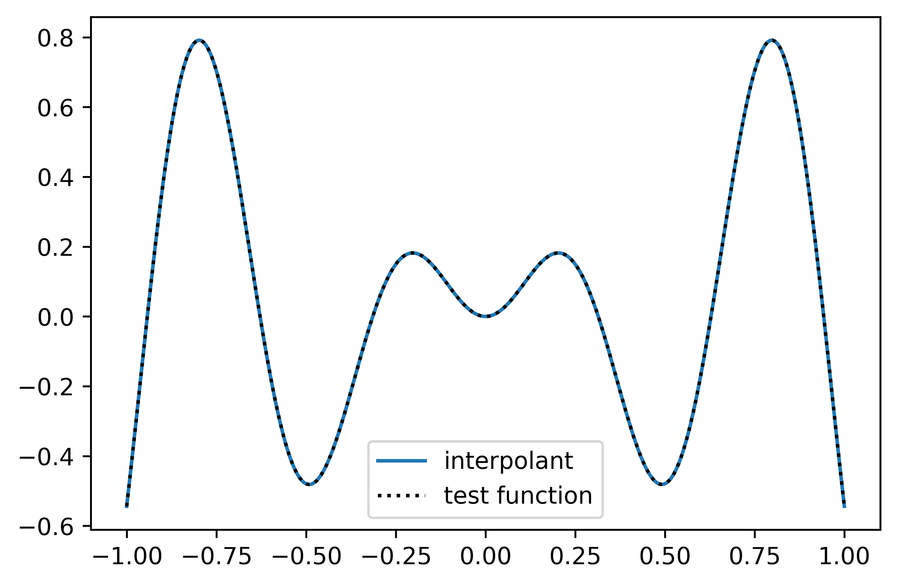

[![Code style: black][black-badge]][black-link]
# minterpy

<figure class="quote">
  <blockquote>
  to minterpy *sth.* (transitive verb) -- to produce a multivariate polynomial representation of *sth.* .
  </blockquote>
  <figcaption>
    &mdash; The minterpy developers in <cite>["Lifting the curse of dimensionality"](https://interpol.pages.hzdr.de/minterpy/fundamentals/introduction.html)</cite>
  </figcaption>
</figure>

---

`minterpy` is an open-source Python package for a multivariate generalization
of the classical Newton and Lagrange interpolation schemes as well as related tasks.
It is based on an optimized re-implementation of
the multivariate interpolation prototype algorithm (*MIP*) by Hecht et al.[^1]
and thereby provides software solutions that lift the curse of dimensionality from interpolation tasks.
While interpolation occurs as the bottleneck of most computational challenges,
`minterpy` aims to free empirical sciences from their computational limitations.

`minterpy` is continuously extended and improved
by adding further functionality and modules that provide novel digital solutions
to a broad field of computational challenges, including but not limited to:

- multivariate interpolation
- non-linear polynomial regression
- numerical integration
- global (black-box) optimization
- surface level-set methods
- non-periodic spectral partial differential equations (PDE) solvers on
  flat and complex geometries
- machine learning regularization
- data reconstruction
- computational solutions in algebraic geometry

## Installation

Since this implementation is a prototype,
we currently only provide the installation by self-building from source.
We recommend to using `git` to get the `minterpy` source:

```bash
git clone https://gitlab.hzdr.de/interpol/minterpy.git
```

Within the source directory,
you may use the following package manager to install ``minterpy``.

A best practice is to create a virtual environment for `minterpy`.
You can do this with the help of [conda] and the ``environment.yaml`` by:

```bash
conda env create -f environment.yaml
```

A new conda environment called `minterpy` is created.
Activate the new environment by:

```bash
conda activate minterpy
```

From within the environment, install the `minterpy` using [pip],

```bash
pip install [-e] .[all,dev,docs]
```

where the flag `-e` means the package is directly linked
into the python site-packages of your Python version.
The options `[all,dev,docs]` refer to the requirements defined
in the `options.extras_require` section in `setup.cfg`.

You **must not** use the command `python setup.py install` to install `minterpy`,
as you cannot always assume the files `setup.py` will always be present
in the further development of `minterpy`.

Finally, if you want to deactivate the conda environment, type:

```bash
conda deactivate
```

Alternative to conda, you can create a new virtual environment via
[venv], [virtualenv], or [pyenv-virtualenv].
See [CONTRIBUTING.md](./CONTRIBUTING.md) for details.

## Quickstart

With `minterpy` one can easily interpolate a given function.
For instance, take the function `f(x) = x\sin(10x)` in one dimension:

```python
    import numpy as np

    def test_function(x):
        return x * np.sin(10*x)
```

In order to `minterpy` the function `test_function`
one can use the top-level function `interpolate`:

```python
    import minterpy as mp

    interpolant = mp.interpolate(test_function,spatial_dimension=1, poly_degree=64)
```

Here, interpolant is a callable function,
which can be used as a representation of `test_function`.
`interpolate` takes as arguments the function to interpolate,
the number of dimensions (`spatial_dimension`),
and the degree of the underlying polynomial (`poly_degree`).

You may adjust this parameter in order to get higher accuracy.
For the example above, a degree of 64 produces an interpolant that reproduces
the `test_function` almost up to machine precision:

```python
    import matplotlib.pylab as plt

    x = np.linspace(-1,1,100)

    plt.plot(x,interpolant(x),label="interpolant")
    plt.plot(x,test_function(x),"k.",label="test function")
    plt.legend()
    plt.show()
```



For more comprehensive examples, see the [getting started guides](https://interpol.pages.hzdr.de/minterpy/getting-started/index.html)
section of the ``minterpy`` docs.

## Testing

After installation, we encourage you to at least run the unit tests of `minterpy`,
where we use [`pytest`](https://docs.pytest.org/en/6.2.x/) to run the tests.

If you want to run all tests, type:

```bash
pytest [-vvv]
```

from within the `minterpy` source directory.

## Contributing to `minterpy`

Contributions to the `minterpy` packages are highly welcome.
We recommend you have a look at the [CONTRIBUTING.md](./CONTRIBUTING.md) first.
For a more comprehensive contribution guide visit
the [Contributors section](link-to-developer-section) of the documentation.

## Credits and contributors

This work was partly funded by the Center for Advanced Systems Understanding (CASUS)
that is financed by Germany’s Federal Ministry of Education and Research (BMBF)
and by the Saxony Ministry for Science, Culture and Tourism (SMWK)
with tax funds on the basis of the budget approved by the Saxony State Parliament.

### The minterpy development team

The core development of the `minterpy` is currently done
by a small team at the Center for Advanced Systems Understanding ([CASUS]),
namely

- Uwe Hernandez Acosta ([HZDR]/[CASUS]) (u.hernandez@hzdr.de)
- Sachin Krishnan Thekke Veettil ([HZDR]/[CASUS]) (s.thekke-veettil@hzdr.de)
- Damar Wicaksono ([HZDR]/[CASUS]) (d.wicaksono@hzdr.de)
- Janina Schreiber ([HZDR]/[CASUS]) (j.schreiber@hzdr.de)

### Mathematical foundation

- Michael Hecht ([HZDR]/[CASUS]) (m.hecht@hzdr.de)

### Former Members and Contributions

- Jannik Michelfeit
- Nico Hoffman ([HZDR])
- Steve Schmerler ([HZDR])
- Vidya Chandrashekar (TU Dresden)

### Acknowledgement

- Klaus Steiniger ([HZDR])
- Patrick Stiller ([HZDR])
- Matthias Werner ([HZDR])
- Krzysztof Gonciarz ([MPI-CBG],[CSBD])
- Attila Cangi ([HZDR]/[CASUS])
- Michael Bussmann ([HZDR]/[CASUS])

### Community

This package would not be possible without many contributions done
from the community as well.
For that, we want to send big thanks to:

  - the guy who will show me how to include a list of contributors on github/gitlab


## License

[MIT](LICENSE) © minterpy development team

[^1]: [arXiv:2010.10824](https://arxiv.org/abs/2010.10824)

[conda]: https://docs.conda.io/
[pip]: https://pip.pypa.io/en/stable/
[venv]: https://docs.python.org/3/tutorial/venv.html
[virtualenv]: https://virtualenv.pypa.io/en/latest/
[pyenv-virtualenv]: https://github.com/pyenv/pyenv-virtualenv
[pre-commit]: https://pre-commit.com/
[Jupyter]: https://jupyter.org/
[nbstripout]: https://github.com/kynan/nbstripout
[Google style]: http://google.github.io/styleguide/pyguide.html#38-comments-and-docstrings
[virtualenv]: https://virtualenv.pypa.io/en/latest/index.html
[pytest]: https://docs.pytest.org/en/6.2.x/
[CASUS]: https://www.casus.science
[HZDR]: https://www.hzdr.de
[MPI-CBG]: https://www.mpi-cbg.de
[CSBD]: https://www.csbdresden.de


[black-badge]:              https://img.shields.io/badge/code%20style-black-000000.svg
[black-link]:               https://github.com/psf/black

