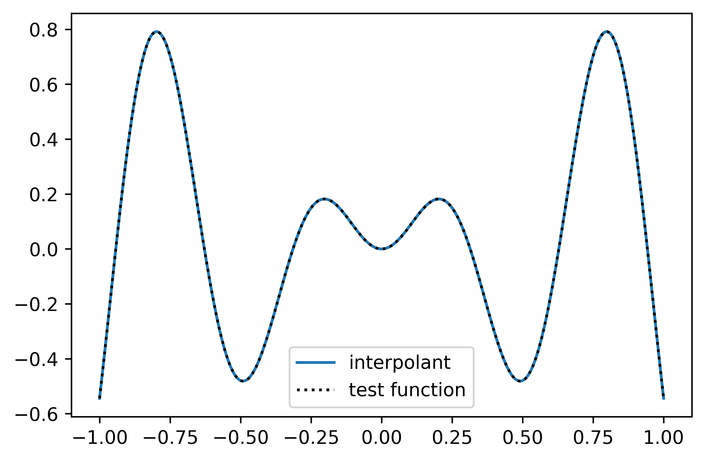

# minterpy

<figure class="quote">
  <blockquote>
  to minterpy *sth.* (transitive verb) -- to produce a multivariate polynomial representation of *sth.* .
  </blockquote>
  <figcaption>
    &mdash; The minterpy developers in <cite>["Lifting the curse of dimensionality"](link-to-math-intro)</cite>
  </figcaption>
</figure>

---

``minterpy`` is an open-source python package for multivariate generalisations of the classical Newton and Lagrange interpolation schemes as well as related tasks. It is based on an optimized re-implementation of
the multivariate interpolation prototype algorithm (*MIP*) by Hecht et al.\ :footcite:`Hecht2020`
and thereby provides software solutions that lift the curse of dimensionality from interpolation tasks.
While interpolation occurs as the bottleneck of most computational challenges,
``minterpy`` aims to free empirical sciences from their computational limitations.

``minterpy`` is continuously extended and improved
by adding further functionality and modules that provide novel digital solutions
to a broad field of computational challenges, including but not limited to:

- multivariate interpolation
- non-linear polynomial regression
- numerical integration
- global (black-box) optimization
- surface level-set methods
- non-periodic spectral partial differential equations (PDE) solvers on
  flat and complex geometries
- machine learning regularization
- data reconstruction
- computational solutions in algebraic geometry

## Installation

Since this implementation is a prototype, we currently only provide the installation by self-building from source. It is recommended to use ``git`` to get the ``minterpy`` source:
```bash
git clone https://gitlab.hzdr.de/interpol/minterpy.git
```
Within the source directory, one may use the following package manager to install ``minterpy``.

#### Using [conda](https://conda.io/projects/conda/en/latest/index.html):
Best practice is to create an environment ``minterpy`` with the help of [conda] and the ``environment.yaml``,
```bash
conda env create -f environment.yaml
```
After building the virtual environments, one need to activate it
```bash
conda activate minterpy
```
Maybe you need to `init` the conda environment. To deactivate the conda environment, just hit:
```bash
conda deactivate
```
#### using [pip](https://pip.pypa.io/en/stable/)
Installing ``minterpy`` via [pip] (in the activated environment, see above) it is also recommended to use a virtual environment (see [CONTRIBUTING.md](./CONTRIBUTING.md) for details). To install ``minterpy``, just run
```bash
pip install [-e] .[all,dev,docs]
```
where the flag `-e` means the package is directly linked into the python site-packages of your python version (e.g. the one in the virtualenv).
The options `[all,dev,docs]` refer to the requirements defined in the `options.extras_require` section in `setup.cfg`.
One shall **not** use :code:`python setup.py install`, since one shall not assume that the file `setup.py` will be always present in further developments of ``minterpy``.

## Quickstart
With ``minterpy`` one can easily interpolate a given function. For instance, take the function :math:`f(x) = x\sin(10x)`in one spacial dimentsion:

```python

    import numpy as np
    import minterpy as mp

    def test_function(x):
        return x*sin(10*x)
```

In order to ``minterpy`` the function :code:`test_function` one can use the top-level function :code:`interpolate`:

```python

    interpolant = mp.interplate(test_function,spatial_dimension=1, poly_degree=64)
```

Here, interpolant is a callable function, which can be used as a representation of :code:`test_function`.
Beside the keyword argument :code:`spatial_dimension`, which is self-explanatory, there is the keyword :code:`poly_degree`, which denotes the degree of the underlying polynomial. Therefore, one may adjust this parameter in order to get higher accuracy. For the example above, a degree of 64 produces an interpolant which reproduces the :code:`test_function` almost up to machine precision:

```python
    import matplotlib.pylab as plt

    x = np.linspace(-1,1,100)

    plt.plot(x,interpolant(x),label="interpolant")
    plt.plot(x,test_function(x),"k.",label="test function")
    plt.legend()
    plt.show()
```


For a more comprehensive examples, see the [tutorial](link-to-tutorials) section of the ``minterpy`` documentation.

## Testing
After installation, it is recommended to at least run the unit tests of ``minterpy``, where we use [`pytest`](https://docs.pytest.org/en/6.2.x/) to run the tests. If you want to run all tests, just hit
```bash
pytest [-vvv]
```
within the ``minterpy`` source directory.

## Contributing to ``minterpy``
Contributions to the ``minterpy`` packages are highly wellcome. For that it is recommended to have a look on the [CONTRIBUTING.md] first. For a more complehensive contribution guide visit the [developer section](link-to-developer-section) of the documentation.

## Credits and contributers
This work was partly funded by the Center for Advanced Systems Understanding (CASUS) that is financed by Germany’s Federal Ministry of Education and Research (BMBF) and by the Saxon Ministry for Science, Culture and Tourism (SMWK) with tax funds on the basis of the budget approved by the Saxon State Parliament.

#### Main code development
The core development of the ``minterpy`` is currently done by a small team at the Center for Advanced Systems Understanding ([CASUS]), namely

- Uwe Hernandez Acosta ([HZDR]/[CASUS]) (u.hernandez@hzdr.de)
- Sachin Krishnan Thekke Veettil ([HZDR]/[CASUS]) (s.thekke-veettil@hzdr.de)
- Damar Wicaksono (add-email-here)

#### Mathematical foundation
- Michael Hecht ([HZDR]/[CASUS]) (m.hecht@hzdr.de)

#### Former Members and Contributions
- Jannik Michelfeit
- Nico Hoffman ([HZDR])
- Steve Schmerler ([HZDR])
- Vidya Chandrashekar (TU Dresden)

#### Acknowledgement
- Klaus Steiniger ([HZDR])
- Patrick Stiller ([HZDR])
- Matthias Werner ([HZDR])
- Krzysztof Gonciarz ([MPI-CBG],[CSBD])
- Attila Cangi ([HZDR]/[CASUS])
- Michael Bussmann ([HZDR]/[CASUS])

#### Community
This package would not be possible without many contributions done from the commuity as well. For that we want send big thanks to:

  - the guy who will show me how to include a list of contributers on github/gitlab


[conda]: https://docs.conda.io/
[pre-commit]: https://pre-commit.com/
[Jupyter]: https://jupyter.org/
[nbstripout]: https://github.com/kynan/nbstripout
[Google style]: http://google.github.io/styleguide/pyguide.html#38-comments-and-docstrings
[virtualenv]: https://virtualenv.pypa.io/en/latest/index.html
[pytest]: https://docs.pytest.org/en/6.2.x/
[CASUS]: https://www.casus.science
[HZDR]: https://www.hzdr.de
[MPI-CBG]: https://www.mpi-cbg.de
[CSBD]: https://www.csbdresden.de


## :construction: :construction:  Useful badges:

[![Actions Status][actions-badge]][actions-link]
[![Documentation Status][rtd-badge]][rtd-link]
[![Code style: black][black-badge]][black-link]

[![PyPI version][pypi-version]][pypi-link]
[![Conda-Forge][conda-badge]][conda-link]
[![PyPI platforms][pypi-platforms]][pypi-link]


[actions-badge]:            https://gitlab.hzdr.de/interpol/minterpy/workflows/CI/badge.svg
[actions-link]:             https://gitlab.hzdr.de/interpol/minterpy/actions
[black-badge]:              https://img.shields.io/badge/code%20style-black-000000.svg
[black-link]:               https://github.com/psf/black
[conda-badge]:              https://img.shields.io/conda/vn/conda-forge/minterpy
[conda-link]:               https://github.com/conda-forge/minterpy-feedstock
[github-discussions-badge]: https://img.shields.io/static/v1?label=Discussions&message=Ask&color=blue&logo=github
[github-discussions-link]:  https://gitlab.hzdr.de/interpol/minterpy/discussions
[gitter-badge]:             https://badges.gitter.im/https://gitlab.hzdr.de/interpol/minterpy/community.svg
[gitter-link]:              https://gitter.im/https://gitlab.hzdr.de/interpol/minterpy/community?utm_source=badge&utm_medium=badge&utm_campaign=pr-badge
[pypi-link]:                https://pypi.org/project/minterpy/
[pypi-platforms]:           https://img.shields.io/pypi/pyversions/minterpy
[pypi-version]:             https://badge.fury.io/py/minterpy.svg
[rtd-badge]:                https://readthedocs.org/projects/minterpy/badge/?version=latest
[rtd-link]:                 https://minterpy.readthedocs.io/en/latest/?badge=latest
[sk-badge]:                 https://scikit-hep.org/assets/images/Scikit--HEP-Project-blue.svg

## :construction: :construction: Todos
- insert missing links
- add sponsor logos (CASUS, HZDR, CSBD?, MPI-CBG?)
- write shorter installation section
- write more comprehensive quickstart (maybe higher dimensionality)
-
