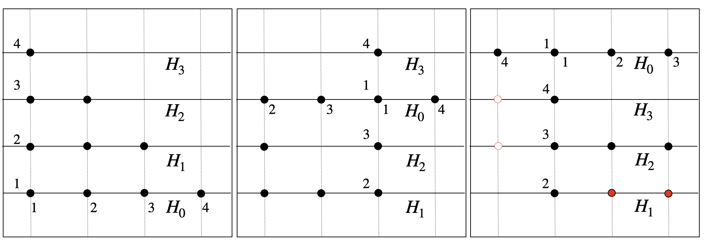
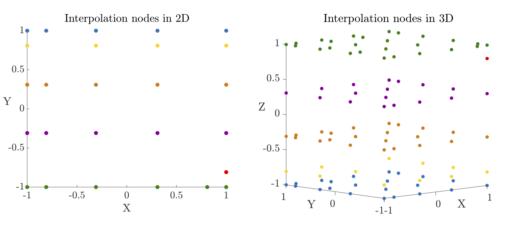

#################################
Interpolation in unisolvent nodes
#################################

..
    .. todo::

       This page should provide explanations on interpolation on the unisolvent nodes.
       Define and explain all the specific terms, including:

       - Generating values (Chebyshev, etc.)
       - Generating nodes
       - Generating points
       - Unisolvent nodes
       - Newton interpolating polynomials
       - Lagrange interpolating polynomials

       Note:

       - Don't forget to include some pictures
       - Clearly distinguish `Newton polynomials (basis)` and `Newton (interpolating) polynomials`
       - Try to separate the implementation or algorithmic implementation details in other section of the documentation

       .. todo::

          Generate the links to

          - multivariate DDS
          - multi-index set
          - notion of unisolvence
          - wikipedia linkls to Leja ordering, Chebyshev Legenedre nodes etc.

Generating nodes
################

The generating nodes are given by choosing arbitrary sets :math:`P_i \subseteq [-1,1]` of :math:`n_i=|P_i| \in \mathbb{N}` nodes for each dimension :math:`m \in \mathbb{N}` such that
for fixed  **multi-index set** :math:`A\subseteq \mathbb{N}` there holds   :math:`n_i \geq \max \{\alpha_i : \alpha \in A\}`.

Whenever :math:`A = A_{m,n,p}` is given by a multi-index set of specified degree then
by default the nodes are chosen to be the **Chebyshev-Lobatto nodes**

.. math::
  :label: eq_Cheb

  P_i =\{p_{0,i},\dots,p_{n,i}\} = (-1)^m \mathrm{Cheb}_n = \left\{ \cos(k\pi/n) :  0 \leq k \leq n\right\}

Apart from **equidistant nodes** other prominent choices of generating nodes are given by the **Gauss-Legendre nodes, Chebyshev nodes of first \& second kind, equidistant nodes, etc.**,
see e.g.\ :footcite:`stoer2002,trefethen2019,gautschi2012`.
For treating the generating nodes in a compactified way they are implemented as an array

.. math::

  \mathrm{GP} = \oplus_{i=1}^m P_i\,.

Crucial is the choice of the ordering of the node sets :math:`P_i`.
By default we assume that the generating nodes :math:`\mathrm{GP}`
are **Leja-ordered**\ :footcite:`Leja1957`, i.e, there holds:

.. math::
  |p_0| = \max_{p \in P}|p|\,, \quad \prod_{i=0}^{j-1}|p_j-p_i| = \max_{j\leq k\leq m} \prod_{i=0}^{j-1}|p_k-p_i|\,,\quad 1 \leq j \leq n\,.

The Leja ordering does not only guarantee numerical stability of the **Newton interpolation** realised in the
**multivariate DDS** but also makes the resulting **unisolvent nodes** to be a (sparse, non-tensorial) grid of high approximation power.

Unisolvent nodes
################

For  **multi-index set** :math:`A \subseteq \mathbb{N}^m` and chosen **generating nodes** :math:`\mathrm{GP} = \oplus_{i=1}^m P_i` the unisolvent nodes are given as the sub-grid

.. math::

  P_A = \left\{ p_\alpha = (p_{\alpha_1,1},\ldots,p_{\alpha_m,m}) \in \Omega\subseteq \mathbb{R}^m : \alpha \in A\right\}\,, \quad p_{\alpha_i,i} \in P_i\,.

In addition to the possible different choices of the :math:`P_i` in each dimension the impact of different orderings can be observed in the example below.
Thereby, the :math:`P_i` just differ in their orderings that are indicated by enumerations along the dimensions (:math:`x,y`). The resulting unisolvent nodes
may be given by *non-tensorial or non-symmetric grids*, where nodes exist with :math:`p=(p_x,p_y) \in P_A`, but :math:`(p_y,p_x)\not \in P_A`.

  Unisolvent nodes for :math:`A= A_{2,3,1}` (left, middle) and :math:`A_{2,3,2}` (right). Orderings in :math:`x,y`--directions are indicated by numbers and non-tensorial nodes  :math:`p=(p_x,p_y) \in P_A` in red with missing symmetric
  blank counter parts :math:`(p_y,p_x)\not \in P_A`.

Examples of unisolvent nodes in 2D \& 3D for the default choice of Leja ordered Chebyshev-Lobatto nodes given in :eq:`eq_Cheb` are visulaised below.

  Leja ordered Chebyshev-Lobatto nodes for Euclidian :math:`l_2`-degree :math:`n=5`.

From a general perspective, a deeper discussion of their construction
and resulting properties is given in\ :footcite:`Hecht2020`. Most crucial is the fact that for downward closed multi-index sets :math:`A\subseteq \mathbb{N}^m`
the interpolant :math:`Q_{f,A}` is uniquely determined in the **polynomial space**

.. math::
   \Pi_A =\left<x^\alpha = x_1^{\alpha_1}\cdots x_m^{\alpha_m} : \alpha \in A\right>

spanned by all **canonical** monimials.

Lagrange interpolation
######################

Given a set of multi-indices :math:`A \subseteq \mathbb{N}^m\,, m \in \mathbb{N}`, unsisolvent nodes :math:`P_A \subseteq \Omega = [-1,1]^m`
and a function :math:`f: \Omega\longrightarrow \mathbb{R}` the uniquely determined  Lagrange interpolant :math:`Q_{f,A}` of :math:`f`
is given by

.. math::
  Q_{f,A}(x) = \sum_{\alpha \in A}f(p_{\alpha})L_{\alpha}(x)\,, \quad p_{\alpha} \in P_A\,,

where :math:`L_\alpha` denote the **Lagrange polynomials** satisfying :math:`L_{\alpha}(p_\beta) = \delta_{\alpha,\beta}` with
:math:`\delta_{\cdot,\cdot}` denoting the **Kronecker delta**. In fact, deriving the Lagrange interpolant :math:`Q_{f,A}` of a function :math:`f` is trivial and can be executed with linear  :math:`\mathcal{O}(|A|)`
storage amount and runtime complexity whenever the unisolvent nodes :math:`P_A` are given. However, Lagrange interpolation is a rather theoretical concept
while it does not provide a computational scheme for evaluating the interpolant :math:`Q_{f,A}` in any given argument :math:`y \in \Omega`.

..
  In fact, the Lagrange polynomials yield approximations of the delta distribution :math:`L_{\alpha} \approx \delta_{p_{\alpha}}`.
  While any function can be expanded with respect to convolution with the delta distribution
  .. math::

    f(x) = f(y) * \delta_{x,y} = \frac{1}{|\Omega|}\int_{\Omega} f(y)\delta_{x,y} dy

    this yields an abstract perspective on Lagrange interpolation

Newton interpolation
####################

In contrast to Lagrange interpolation, Newton interpolation derives the uniquely determined Newton interpolant :math:`Q_{f,A}` of :math:`f`
given by

.. math::

  Q_{f,A}(x) = \sum_{\alpha \in A}c_\alpha N_{\alpha}(x)\,, \quad \alpha \in A\,,

where :math:`A \subseteq \mathbb{N}^m` is a set of multi-indices, :math:`P_A \subseteq \Omega = [-1,1]^m` denotes the
unsisolvent nodes and :math:`f: \Omega\longrightarrow \mathbb{R}` a function.

Thereby, the coefficients :math:`c_\alpha \in \mathbb{R}` of the
Newton polynomials

.. math::
  N_\alpha(x) = \prod_{i=1}^m\prod_{j=0}^{\alpha_i -1}(x- p_{j,i})\,,\quad  p_{j,i} \in P_i

can be derived by the **multivariate Divided Difference Scheme (DDS)** whenever the generating nodes :math:`\mathrm{GP} = \oplus_{i=1}^m P_i` are fixed.
In fact, DDS requires quadratic :math:`\mathcal{O}(|A|^2)`
runtime complexity and linear storage :math:`\mathcal{O}(|A|)` amount.

Once given the Newton interpolant of a function :math:`f` its **evaluation** can be realised by a generalisation of the classic
**Aitken-Neville algorithm**\ :footcite:`neville`.

References
##########

.. footbibliography::
