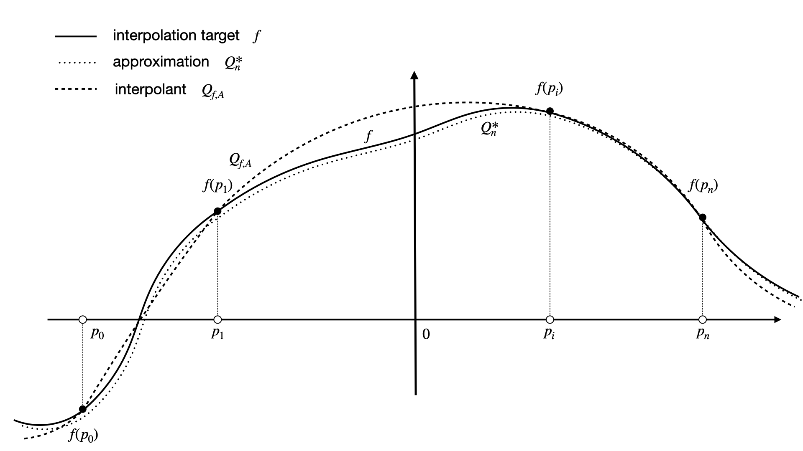
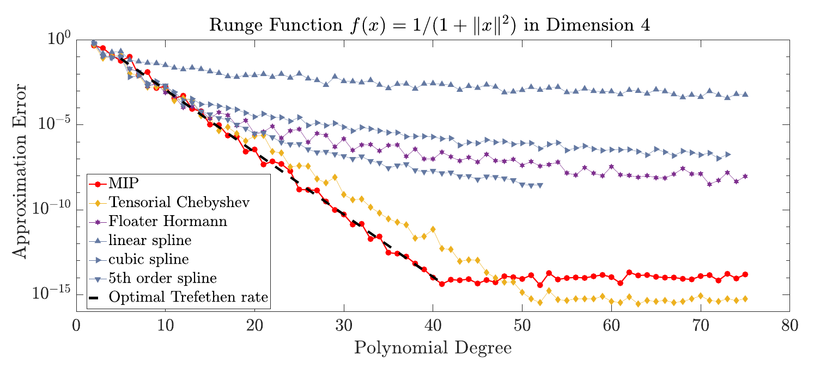

############
Introduction
############

..
    .. todo::

       Provide some explanation on:

       - Interpolation problem
       - Field of applications
       - Runge phenomenon
       - Curse of dimensionality
       - Differentiating aspects of ``minterpy``

       What's written below is the older mathematical introduction to ``minterpy``.
       While quite comprehensive, it is rather dense and can be splitted into
       different parts of the documentation.

       get the refs upgraded

    In this section we present the mathematical concepts and conventions,
    the implementation of ``minterpy`` is based on. Throughout, the documentation :math:`\Omega=[-1,1]^m\,, m \in \mathbb{N}`
    denotes the standard m-dimensional hypercube and we assume that all interpolation tasks are normalised to :math:`\Omega`.

Multivariate polynomial interpolation
#####################################

Polynomial interpolation goes back to Newton, Lagrange, and others\ :footcite:`meijering2002`,
and its fundamental importance for mathematics and computing is undisputed.
Interpolation is based on the fact that, in 1D, one and only one polynomial :math:`Q_{f,A}` of degree :math:`n \in \mathbb{N}` can
interpolate a function :math:`f : \mathbb{R} \longrightarrow \mathbb{R}` on :math:`n+1` distinct
*unisolvent interpolation nodes*
:math:`P_A = \{p_i\}_{i \in A} \subseteq \mathbb{R}`, :math:`A=\{0, \ldots, n\}`, i.e.,

.. math::

  Q_{f,A}(p_i) = f(p_i)\,, \quad \text{for all} \quad  p_i \in P_A \,, i \in A\,.

This makes interpolation fundamentally different from approximation, see Figure 1.

    Figure 1: Interpolation and approximation in 1D. While the interpolant :math:`Q_{f,A}` has to coincide with :math:`f`
    in the interpolation nodes :math:`p_0,\ldots,p_n` an approximation :math:`Q^*_n` does not have to coincide with :math:`f` at all.

The famous *Weierstrass Approximation Theorem*\ :footcite:`weierstrass1885` states
that any continuous function :math:`f : \Omega\longrightarrow \mathbb{R}` defined on compact domain, e.g. :math:`\Omega = [-1,1]^m`,
can be uniformly approximated by polynomials\ :footcite:`debranges1959`.
However, the Weierstrass Approximation Theorem does not require the polynomials
to coincide with :math:`f` at all, i.e., it is possible that there is a sequence of multivariate polynomials
:math:`Q_{n}^*`, :math:`n \in \mathbb{N}` with :math:`Q_{n}^*(x) \not = f(x)` for all :math:`x \in \Omega`,
but still

.. math::

  Q_{n}^* \xrightarrow[n \rightarrow \infty]{} f \quad \text{uniformly on} \quad \Omega\,.

There are several constructive proofs of the Weierstrass approximation theorem, including the prominent version given by Serge Bernstein\ :footcite:`bernstein1912`.
Although the resulting *Bernstein approximation scheme*
is universal and has been proven to reach the optimal (inverse-linear) approximation rate for the absolute value function :math:`f(x) = |x|`
\ :footcite:`bernstein1914`,
it achieves only slow convergence rates for analytic functions, resulting in a high computational cost in practice.

There has therefore been much research into extending 1D Newton
or Lagrange interpolation schemes to multi–dimensions (mD) by maintaining their
computational power.
Any approach that addresses this problem has to avoid Runge's phenomenon\ :footcite:`runge1901` (overfitting) by guaranteeing uniform approximation of the
interpolation target :math:`f : \Omega \longrightarrow \mathbb{R}` and resist the *curse of dimensionality*, i.e.,
reach highly accurate polynomial approximations of general multivariate functions with a sub-exponentially depending demand of data samples :math:`f(p)\,,p \in P_A`, :math:`|P_A|\in o(n^m)`.

Lifting the curse of dimensionality
###################################

To address the problem we consider the :math:`l_p`-norm :math:`\|\alpha\|_p = (\alpha_1^p + \cdots +\alpha_m^p)^{1/p}`,
:math:`\alpha = (\alpha_1,\dots,\alpha_m) \in\mathbb{N}^m`, :math:`m \in \mathbb{N}` and the
*lexicographical ordered* :doc:`../api/core/multi_index`.

.. math::
  :label: eq_A

  A_{m,n,p} = \left\{\alpha \in \mathbb{N}^m : \|\alpha\|_p \leq n \right\}\,, \quad m,n \in \mathbb{N}\,, p \geq 1\,.

This notion generalises the 1D notion of polynomial degree to multi-dimensional :math:`l_p`-degree, i.e, we consider
the polynomial spaces spanned by all monomials of bounded :math:`l_p`-degree

.. math::

   \Pi_A =  \left< x^\alpha = x^{\alpha_1}\cdots x^{\alpha_m} : \alpha \in A \right>\,, A =A_{m,n,p}\,.

Given :math:`A=A_{m,n,p}` we ask for:

:math:`i)` Unisolvent interpolation nodes :math:`P_A` that uniquely determine the interpolant :math:`Q_{f,A} \in \Pi_A`
by satisfying :math:`Q_{f,A}(p_{\alpha}) = f(p_{\alpha})`, :math:`\forall p_{\alpha} \in P_A`, :math:`\alpha \in A`.

:math:`ii)` An interpolation scheme :doc:`/fundamentals/multivariate-dds` that computes the uniquely determined interpolant :math:`Q_{f,A} \in \Pi_A`
efficiently and numerically accurate (with machine precision).

:math:`iii)` The unisolvent nodes :math:`P_A` that scale sub-exponentially with the space dimension :math:`m \in \mathbb{N}`,
:math:`|P_A| \in o(n^m)` and guarantee uniform approximation of even strongly varying functions (avoiding over
fitting) as the Runge function :math:`f_R(x) = 1/(1+\|x\|^2)` by fast (ideally exponential) approximation rates.

       Approximation errors rates for interpolating the Runge function in dimension :math:`m = 4`.

In fact, the results of\ :footcite:`Hecht2020` suggest that the therein presented :doc:`multivariate DDS </fundamentals/multivariate-dds>` resolves issues :math:`i) - iii)` for so called *Trefethen functions*
when choosing Euclidian :math:`l_2`-degree and **Leja ordered Chebyshev-Lobatto unisolvent interpolation nodes** :math:`P_A`. Thereby,

.. math::

  |P_A| \approx \frac{(n+1)^m }{\sqrt{\pi m}} (\frac{\pi \mathrm{e}}{2m})^{m/2} \in o(n^m)\,, \quad  A=A_{m,n,2}\,,

scales sub-expomemtially with space dimension :math:`m` and

.. math::

  Q_{f,A_{m,n,2}} \xrightarrow[n\rightarrow \infty]{} f

converges uniformly and fast (exponentially) on :math:`\Omega = [-1,1]^m`.
Figure 2 shows the approximation rates of the classic Runge function\ :footcite:`runge1901` in dimension :math:`m=4`,
which is known to cause Runge's pehenomenon (over-fitting) when interpolated naïvely.
There is an optimal (upper bound) approximation rate

.. math::
  \|Q_{f,A} - f\| \in \mathcal{O}_{\varepsilon}(\rho^{-n})

known\ :footcite:`trefethen2017`,which we call the *Trefethen rate*.

In fact, the :doc:`/fundamentals/multivariate-dds` scheme numerically reaches the optimal Trefethen rate.
In contrast,
spline-type interpolation is based on works of Carl de Boor
et al.\ :footcite:`deboor1972, deboor1977, deboor1978, deboor2010` and limited
to reach only polynomial approximation rates\ :footcite:`deboor1988`.
Similarly, interpolation by rational functions as in Floater-Hormann interpolation\ :footcite:`cirillo2017, floater2007`
and tensorial Chebyshev interpolation, relying on :math:`l_{\infty}`-degree\ :footcite:`gaure2018`,
miss optimality.

Combining sub-exponential node (data) counts with exponential approximation rates, the **DDS** algorithm
may *lift the curse of dimensionality* for interpolation problems of regular (Trefethen) functions\ :footcite:`Hecht2020`.

The notion of unisolvence
#########################

The pioneering works of\ :footcite:`kuntz, Guenther, Chung` gave constructions of nodes :math:`P_A` that turn out o be unisolvent
for downward closed :ref:`multi-index sets <fundamentals/polynomial-bases:Multi-index sets and polynomial degree>`  :math:`A= A_{m,n,1}` or :math:`A =A_{m,n,\infty}`
given by :math:`l_1`- or :math:`l_\infty`-degree.

For multi-index sets :math:`A_{m,n,p}`, :math:`1\leq p \leq \infty` and interpolation nodes
:math:`P_A=\{p_{\alpha}\}_{\alpha\in A} \subseteq \Omega =[-1,1]^m`
a set :math:`\{q_{\alpha}\}_{\alpha \in A}` of multivariate polynomials (e.g., :math:`q_{\alpha}(x) = x^\alpha:=x_1^{\alpha_1}\cdots x_m^{\alpha_m}`),
generating the polynomial space :math:`\Pi_A = \left<q_{\alpha} : \alpha \in A \right>`
the *multivariate Vandermonde matrix* is given by

.. math::
  V(P_A) = \big (q_{\beta}(p_{\alpha})\big)_{\alpha,\beta \in A} \in \mathbb{R}^{|A|\times|A|}\,.

For :math:`q_{\alpha}(x) = x^\alpha`, this results in the classic :math:`V(P_A) = \big (p_{\alpha}^\beta\big)_{\alpha,\beta \in A}`\ :footcite:`Gautschi2012`.
If :math:`V(P_A)` is (numerically) invertible, then one can interpolate `f` by solving the linear system of equations

.. math::
  V(P_A)C =F \,,  \quad C= (c_{\alpha})_{\alpha \in A} \,, \,\, \quad F= (f(p_{\alpha}))_{\alpha \in A} \in \mathbb{R}^{|A|}.

This requires :math:`\mathcal{O}(|A|^r)` operations with :math:`r>2`\ :footcite:`Strassen1969,Coppersmith1990`,
whereas the present **DDS** achieves quadratic runtime :math:`\mathcal{O}(|A|^2)`.
Indeed,

.. math::
  Q_{f,A}(x)=\sum_{\alpha \in A}c_\alpha q_\alpha \,\, \in \Pi_A

yields the unique interpolant of :math:`f` in :math:`P_A`, i.e.,  :math:`Q_{f,A}(p)=f(p)` for all :math:`p \in P_A`.
We therefore call a set of nodes :math:`P_A` *unisolvent* with respect to :math:`\Pi_A` if and only if :math:`V(P_A)`
is invertible, i.e., if and only if its null space :math:`\ker V(P_A) =0` is trivial.
The condition :math:`\ker V(P_A) =0` is equivalent to requiring that there exists no hypersurface :math:`H = Q^{-1}(0)`
generated by a polynomial :math:`0\not =Q \in \Pi_A` with :math:`P_A \subseteq H`.
Indeed, the coefficients :math:`C` of such a polynomial would be a non-trivial solution of :math:`V(P_A)C=0`.

However, even if :math:`P_A` is unisolvent, the matrix :math:`V(P_A)` rapidly becomes numerically ill-conditioned for higher dimensions or degrees
when using the canonical basis :math:`q_{\alpha}(x) =x^\alpha`, :math:`\alpha \in A`.
While previous approaches addressed this problem by *tensorial interpolation*\ :footcite:`sauertens, Dyn2014,chebfun`, ``minterpy``
is based on the :doc:`/fundamentals/multivariate-dds` that even for non-tensorial interpolation nodes such as the by default choosen
**Leja ordered Chebyshev-Lobatto nodes** realises efficient and accurate polynomial interpolation.

References
##########

.. footbibliography::
