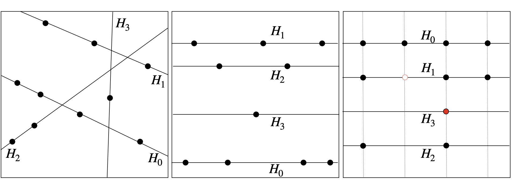
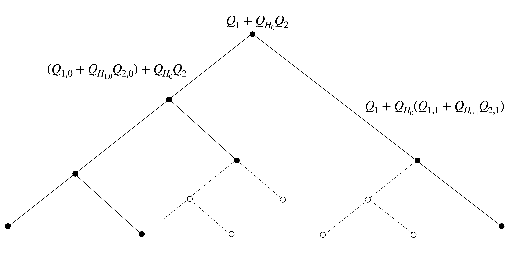
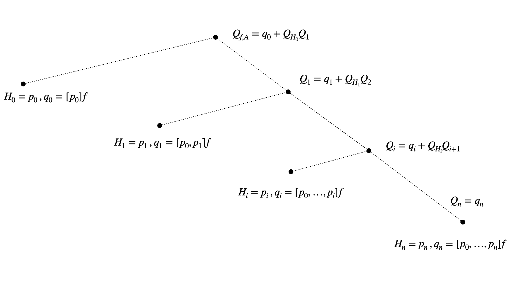
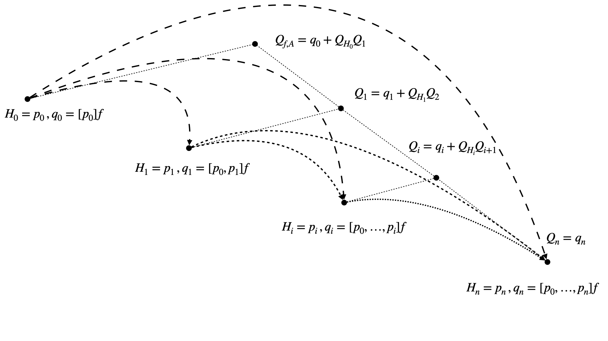
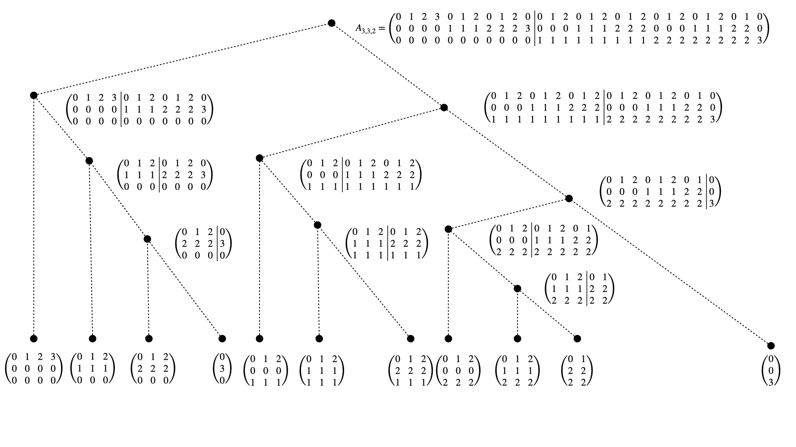
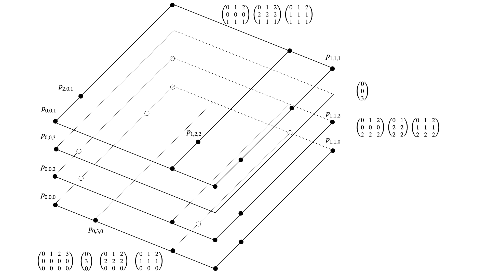
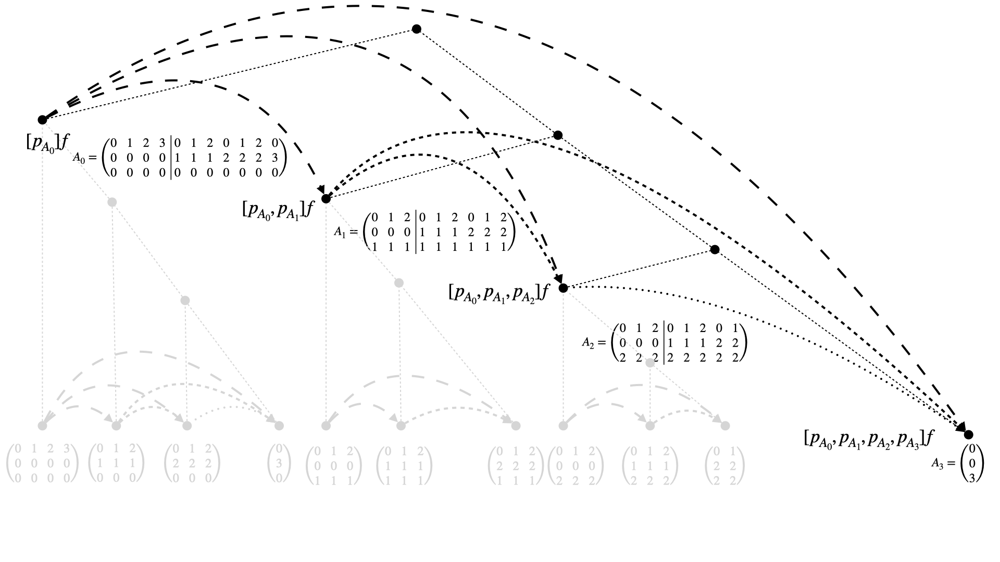

############################################
Multivariate divided difference scheme (DDS)
############################################

..
    .. todo::

       Multivariate DDS is central to the whole ``minterpy`` operation,
       it is important somehow to *demistify* it.
       In this page, all aspects related to the multivariate DDS should be defined
       and explained from the data structure used, construction, and operation.

       Provide illustrations and pictures for clarity and simple (numerical)
       examples that one can do perhaps with hand to demistify it further.
       ``minterpy`` "just" do it faster for larger problems.

       .. todo::

          Generate the links to

          - downward closed multi-index sets
          - polynomial space
          - notion of unisolvence
          - use latex label command for the Theorem enumeration etc

Splitting Theorems
##################

The Multivariate DDS is based on two general splitting Theorems\ :footcite:`Hecht2020` that can be stated in a simplified version as:

**Theorem 1 (Splitting of  unisolvent nodes)** Let :math:`A \subseteq \mathbb{N}^m` be a downward closed multi-index set,
:math:`\Pi_A =\left<x^\alpha = x_1^{\alpha_1}\cdots x_m^{\alpha_m} : \alpha \in A\right>`
be the polynomial space spanned by all monomials induced by :math:`A`,
:math:`H = \{(x_1,\dots,x_m) \in \mathbb{R}^m : x_j = y\}, y \in [-1,1]` for some :math:`1\leq j \leq m` be a hyperplane parallel to the coordinate axis,
:math:`Q_H= (x_j - q_j) \in \Pi_A` and :math:`P \subseteq \mathbb{N}^m`
be a set of nodes such that:

:math:`i)` There is no polynomial :math:`Q \in \Pi_A` being constant in normal direction to :math:`H`, i.e.,  :math:`\partial_{x_j}Q(x) =0`,
and  :math:`Q` vanishes identically on :math:`P \cap H`, i.e., :math:`Q(p) =0\,,  \forall \,p \in  P \cap H`.

:math:`ii)` There is no polynomial :math:`Q \in \Pi_A` with :math:`Q_H\cdot  Q \in \Pi_A`  and :math:`Q`
vanishes identically on :math:`P \setminus H`, i.e, :math:`Q(p) =0\,,  \forall \, p \in  P \setminus H`.

Then, the nodes :math:`P` are unisolvent with respect to :math:`\Pi_A`, i.e, the interpolant :math:`Q_{f,A}(p) = f(p) \,,  \forall \, p \in  P`  of any function :math:`f : \mathbb{R}^m \longrightarrow \mathbb{R}` is uniquely determined in :math:`\Pi_A`.

Below, we show examples of unisolvent nodes in 2D for :math:`A= A_{2,3,1}`, generated by recursively applying Theorem 1. The three panels show examples for three different choices of the, in this case 1D, hyperplanes :math:`H_0,\ldots ,H_3`
(solid lines). In the left panel, the hyperplanes are chosen arbitrarily. This starts by first choosing a hyperplane (line) :math:`H_0` and :math:`n+1=4`
unisolvent nodes on :math:`H_0`. Then choose :math:`H_1 \not = H_0` and 3 unisolvent nodes on :math:`H_1 \setminus H_0`,
and recursively continue until choosing 1 unisolvent node on :math:`H_3\setminus (H_0 \cup H_1 \cup H_2)`.
When choosing the hyperplanes parallel to each other, as shown in the middle panel, this construction results in an irregular grid.
Quantizing the distance between hyperplanes as well as between nodes on them further leads to non-tensorial grids, as shown in the right panel.

  Examples of unisolvent nodes.

**Theorem 2 (Splitting of  the interpolant)** Let the assumptions of Theorem 1 be satisfied. Let in addition

:math:`i)` :math:`Q_1 \in \Pi_{A}` be
a polynomial being constant in normal direction to :math:`H` interpolating :math:`f` in :math:`P\cap H`, i.e,  :math:`Q_{f,A}(p) = f(p) \,,  \forall \, p \in  P\cap H`

:math:`ii)`  :math:`Q_2 \in \Pi_{A}` be
a polynomial with :math:`Q_H\cdot  Q_2 \in \Pi_A` interpolating :math:`f_1:=(f -Q_1)/Q_H` in :math:`P\setminus H`, i.e,

.. math::
  :label: eq_DDS

  Q_{f,A}(p) = f_1(p) =(f(p) - Q_1(p))/Q_H(p) \,, \quad \forall \, p \in  P\setminus H.

Then the unique interpolant
:math:`Q_{f,A}(p)\in \Pi_{A}` is given by

.. math::

  Q_{f,A} = Q_1 + Q_H \cdot Q_2 \,.

In principle, the multivariate DDS is given by recursively applying Theorems 1 \& 2.
The generalised divided difference scheme given by recursively choosing suitable hyper(sub)planes :math:`H_{0}, H_{1,0}, H_{0,1}, \ldots`
and nodes :math:`P=P_0 =P_{1,0}\cup P_{0,1}, \ldots` accordingly to Theorem 1
and applying the splitting Theorem 2 to the separated polynomials :math:`Q_1,Q_2,Q_{1,0},Q_{2,0},Q_{1,1},Q_{2,1},\ldots` as visulaised below.

  The general multivariate Divided difference Scheme.

While in general the DDS requires :math:`\mathcal{O}(|A|^3)` runtime complexity, faster implementations can be realised whenever the
hyperplanes are chosen to be parallel and thereby the resulting **unisolvent nodes** are given as a sub-grid.

1D Divided Difference Scheme
############################

We recapture the classic 1D DDS being the algorithmic solution of 1D Newton interpolation, see e.g.\ :footcite:`stoer2002,gautschi2012`.
Given :math:`n+1` distinct nodes  :math:`p_0,\ldots, p_n\in [-1,1]` and a function :math:`f : [-1,1] \longrightarrow  \mathbb{R}` one recursively
defines

.. math::

  [p_i]f = f(p_i) \,,\quad [p_i,\dots,p_j]f:= \frac{[p_{i+1},\dots,p_j]f -[p_i,\dots,p_{j-1}]f}{p_j-p_i}\,, \,\, j> i\,.

The resulting Newton coefficients, are set as :math:`c_i:= [p_0,\dots,p_i]f`, and uniquely determine
the interpolant :math:`Q_{f,A}`, :math:`A= A_{1,n,1}= \{0,\ldots,n\}` in Newton form, i.e.,

.. math::
  :label: eq_NP

  Q_{f,A}(x) =  \sum_{i=0}^n c_i N_{i}(x)\,, \quad N_i(x) = \prod_{j=0}^{i-1}(x-p_j)\,.

The recursive 1D DDS is thereby classically visualised as follows:

.. math::

  \begin{matrix}
  [p_0]f \\
         & \searrow \\{}
  [p_1]f & \rightarrow  & [p_0,p_1]f  \\
         & \searrow     &                & \searrow     \\{}
  [p_2]f & \rightarrow  & [p_1,p_2]f     & \rightarrow & [p_0,p_1,p_2]f \\{}
   \vdots & \vdots      & \vdots         & \vdots    & \vdots  &\ddots \\{}
    & \searrow     &                & \searrow    & &              & \searrow \\{}
  [p_{n}]f & \rightarrow  & [p_{n-1},p_{n}]f & \rightarrow & [p_{n-2},p_{n-1},p_{n}]f
    & \cdots & \rightarrow & [p_0\ldots p_{n}]f   \\
  \end{matrix}

Alternatively, by observing that a hyperplane :math:`H\subseteq \mathbb{R}` in 1D is given by a point :math:`p \in \mathbb{R}`
and a polynomial :math:`Q` in zero variables is a real number
one can re-interpretate the nodes :math:`p_i\subseteq \mathbb{R}` as hyperplanes :math:`H_i\subseteq \mathbb{R}`,
:math:`0 \leq i \leq n` and the values :math:`[p_i,\ldots,p_j]f \in \mathbb{R}` as polynomials
and recursively apply the splitting Theorems 1 \& 2 in order to observe the following tree decompostion of the problem.

  The 1D DDS from the perspective of Theorems 1 \& 2.

Thus, by using the Newton polynomials from :eq:`eq_NP` and observing that in this special 1D case :eq:`eq_DDS` yields :math:`f_1(p) = [p_0,p_1]f` we derive

.. math::

  Q_{f,A} &= q_0 + Q_{H_0}\Big(q_1 + \ldots +  Q_{H_{i-1}}\big(q_i + \ldots +  Q_{H_{n-1}}q_n \big) \ldots  \Big)\\
    &= \sum_{i=0}^n [p_0,\ldots,p_i]f \, \prod_{j=0}^{i-1}Q_{H_i}\\
    &= \sum_{i=0}^n c_i \prod_{j=0}^{i-1}(x- p_j)\\
    &= \sum_{i=0}^n c_i N_i(x)\,.

In light of this perspective, we can visualise the the recursion of the 1D-DDS in a dependency graph resting on the underlying tree structure as
given below:

  Visulaisation of the dependencies of the leaf nodes accordingly to the 1D-DDS.

In order to generalise the tree decomposition of the Newton interpolation to multi-dimensions, we introduce the
**Multi-index tree** allowing to decode the dependencies given by recursively applying Theorems 1 \& 2 for the multi-dimensional case
in a compactified way.

Multi-index tree
################

The multi-index tree provides the data structure that is needed to generalise
the classic 1D Divided Difference Scheme of degree :math:`n \in \mathbb{N}` to downward closed multi-index sets :math:`A \subseteq \mathbb{N}^m`, e.g.
:math:`A =A_{m,n,p}`.

Here, we give an example for dimension :math:`m=3` degree :math:`n=3` with respect to Euclidian :math:`l_p`-degree :math:`p=2`.
As visualised below the multi-index set :math:`A_{3,3,2}` is splitted into subsets that yield the corresponding interpolation sub problems.

  The tree structure of the splitting of the multi-indices :math:`\alpha \in A_{3,3,2}`.

As one can observe, the splitting separates multi-indices :math:`\alpha, \beta  \in A` whenever they differ in the higher dimensional entries :math:`\alpha_j \not = \beta_j\,, 1 \leq j \leq m` depending on the considered dimension
:math:`j`. In other words: The splitting
assigns multi-indices to the same sub-tree whenever all higher dimensional entries coincide  :math:`\alpha_i  = \beta_i\,,  \forall \, i  \geq j`.
The  *split positions* and  *subtree sizes* are thereby stored when constucting the multi-index-tree.

Splitting of the unisolvent nodes
#################################

Each of the leafs of the multi-index tree induces an **unisolvent interpolation node** and the splitting reflects the parallel 1 \& 2 dimensional hyper-sub-planes(lines)
:math:`H \subseteq \mathbb{R}^m` to which the nodes belong.

  The splitting of the multi-indicies is reflected in the geometric separation of the corresponding **unisolvent nodes**
  :math:`P_A=\left\{p_\alpha = (p_{\alpha_1,1},p_{\alpha_2,2},p_{\alpha_3,3}) : \alpha \in A \right\}`.

Sub-tree recursion
##################

Indeed the node distributions on each hyperplane :math:`H` are subsetes of the projections of the prior (more occupied) plane.
This fact is refleceted when fixing the highest dimension and treating the subtrees belonging to lower dimensional
problems as nodes. The dependencies and recursion of the multivariate DDS with respect to that highest fixed dimensions
result in the prior considered ones of the 1D-DDS as visualised below.

  First recursion step of the multivariate DDS (fixing the highest dimension).

The recursion step is thereby realised by using a precomputed *mask* that matches the nodes/multi-indicies
of each sub-problem/hyperplane to the next one, accordingly.
The recursion is analogously repeated for each subtree independently as sketched (in grey) above.

References
##########

.. footbibliography::
